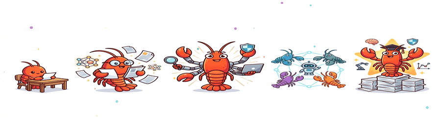
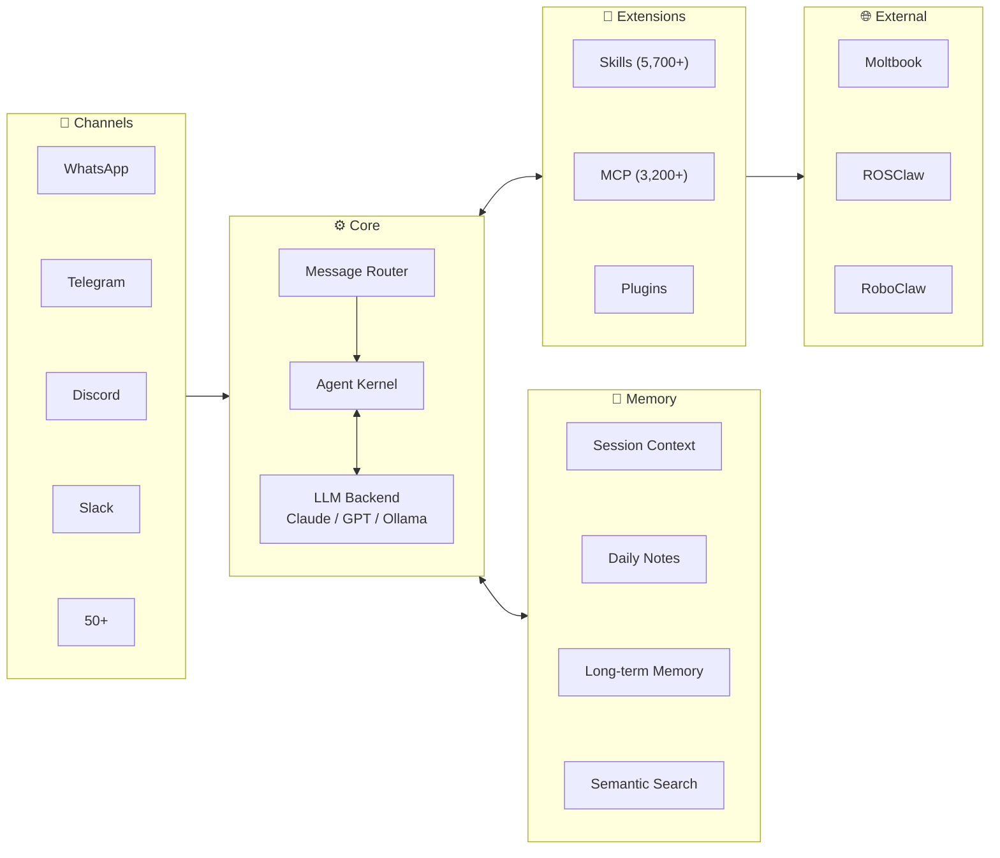

# Awesome-OpenClaw-Research [](https://awesome.re)



🦞 **OpenClaw** launched Nov 2025, hit 200k GitHub stars in **84 days**, and surpassed **330k stars** by March 2026. This repo collects **papers studying or built upon the OpenClaw ecosystem** — covering agent infrastructure, learning, safety, embodiment, social dynamics & domain applications. The questions are universal; OpenClaw is the lens.

<p align="center">
  <a href="#-papers"></a>
  <a href="https://github.com/openclaw/openclaw"></a>
  <a href="./README_CN.md"></a>
  <a href="./README_KR.md"></a>
  <a href="./README_JP.md"></a>
  <a href="#-contributing"></a>
  <a href="https://join.slack.com/t/openclaw-research/shared_invite/zt-3tetckn5x-tOKVsEEQN8ArnyxzqgWsAA"></a>
</p>

---

## Table of Contents

- [Papers](#-papers) — **Core of this repo**
  - [Infrastructure & Systems](#infrastructure--systems)
  - [Learning & Evolution](#learning--evolution)
  - [Safety & Security](#safety--security)
  - [Embodied Agents](#embodied-agents)
  - [Agent Society](#agent-society)
  - [Domain Applications](#domain-applications)
- [Architecture](#-architecture)
- [Ecosystem Timeline](#-ecosystem-timeline)
- [Other Resources](#-other-resources) — SDKs, tools, community, related repos
- [Contributing](#-contributing)

---

## 📄 Papers

> 25+ papers published in Feb–Mar 2026 alone. Each entry includes paper link, code (if available), and key highlights.

### Infrastructure & Systems

> Frameworks, OS paradigms, benchmarks, and protocol evaluation.

| Title | Venue | Date | Paper | Code | Highlights |
|-------|-------|------|-------|------|------------|
| **OpenClaw as Language Infrastructure (Survey)** | Preprints.org | 2026.03 | [](https://www.preprints.org/manuscript/202603.1060) |  | GATE / AERO frameworks; analyzes 38 ecosystem papers |
| **AgentOS: NL-Driven OS Paradigm** | arXiv | 2026.03 | [](https://arxiv.org/abs/2603.08938) |  | Agent-centric OS paradigm; Skills-as-Modules; KDD framing |
| **EvoClaw: Evaluating AI Agents on Continuous Software Evolution** | arXiv | 2026.03 | [](https://arxiv.org/abs/2603.13428) | [](https://github.com/Hydrapse/EvoClaw) [](https://huggingface.co/datasets/hyd2apse/EvoClaw-data) | DeepCommit Milestone DAGs; 7 repos / 5 languages; best agent only 38% in continuous settings |
| **MCP-Atlas: Large-Scale Benchmark for MCP Tool-Use** | arXiv | 2026.02 | [](https://arxiv.org/abs/2602.00933) |  | 36 MCP servers; 220 tools; 1,000 tasks; multi-step workflow eval |

### Learning & Evolution

> Reinforcement learning, meta-learning, and self-improvement of agents.

| Title | Venue | Date | Paper | Code | Highlights |
|-------|-------|------|-------|------|------------|
| **OpenClaw-RL: Train Any Agent Simply by Talking** | arXiv | 2026.03 | [](https://arxiv.org/abs/2603.10165) | [](https://github.com/Gen-Verse/OpenClaw-RL) | Evaluative + Directive signals; async 4-component RL architecture; personalization 0.17→0.81 |
| **MetaClaw: Meta-Learning in the Wild** | arXiv | 2026.03 | [](https://arxiv.org/abs/2603.17187) |  | Continuous meta-learning; skill-driven adaptation; accuracy 21.4% → 40.6% |

### Safety & Security

> Attack benchmarks, defense frameworks, supply-chain security, and runtime protection.

| Title | Venue | Date | Paper | Code | Highlights |
|-------|-------|------|-------|------|------------|
| **PASB: Benchmarking Attacks on OpenClaw** | arXiv | 2026.02 | [](https://arxiv.org/abs/2602.08412) | [](https://github.com/AstorYH/PASB) | End-to-end security eval; only 17% native defense rate |
| **A Trajectory-Based Safety Audit of Clawdbot (OpenClaw)** | arXiv | 2026.02 | [](https://arxiv.org/abs/2602.14364) | [](https://github.com/tychenn/clawdbot_report) | 34 test cases / 6 risk dimensions; overall pass rate 58.9%; Intent Misunderstanding 0% |
| **SkillFortify: Formal Supply Chain Security** | arXiv | 2026.03 | [](https://arxiv.org/abs/2603.00195) | [](https://github.com/qualixar/skillfortify) [](https://pypi.org/project/skillfortify/) | Dolev-Yao modeling; 96.95% F1; 0% false positives; 22 agent frameworks |
| **Don't Let the Claw Grip Your Hand** | arXiv | 2026.03 | [](https://arxiv.org/abs/2603.10387) |  | 47 adversarial scenarios; MITRE ATLAS/ATT&CK; HITL defense: 17% → 19–92% |
| **OpenClaw PRISM: Runtime Security Layer** | arXiv | 2026.03 | [](https://arxiv.org/abs/2603.11853) |  | Defense-in-depth; zero-fork; anti prompt injection |
| **Uncovering Security Threats & Architecting Defenses (FASA)** | arXiv | 2026.03 | [](https://arxiv.org/abs/2603.12644) |  | Tsinghua & Ant Group; tri-layered risk taxonomy; FASA + ClawGuard; 26% community tools have vulns |
| **Defensible Design for OpenClaw** | arXiv | 2026.03 | [](https://arxiv.org/abs/2603.13151) |  | Security-as-engineering blueprint; risk taxonomy; practical research agenda |

### Embodied Agents

> Robotics, physical embodiment, and ROS integration.

| Title | Venue | Date | Paper | Code | Highlights |
|-------|-------|------|-------|------|------------|
| **RoboClaw: Agentic Framework for Robotic Tasks** | arXiv | 2026.03 | [](https://arxiv.org/abs/2603.11558) | [](https://github.com/MINT-SJTU/RoboClaw) | VLA model; Entangled Action Pairs; +25% success rate; −53.7% human effort |
| **ROSClaw: Bridging OpenClaw with ROS 2** | GitHub | 2026.03 | [](https://openclaws.io/blog/openclaw-robotics-embodied-ai) | [](https://github.com/PlaiPin/rosclaw) | SF Hackathon champion; Unitree G1/H1, DJI; runs on RPi4 |
| **RoClaw: Physical Embodiment for OpenClaw** | GitHub | 2026.03 | [](https://evoailabs.medium.com/the-rapid-transformation-of-openclaw-into-a-physical-ai-powerhouse-911d8546c1c0) | [](https://github.com/EvolvingAgentsLabs/RoClaw) | Dual-Brain bytecode architecture; somatic firmware; open-source hardware CAD & simulation |

### Agent Society

> Social behaviors, emergent norms, peer learning, and collective dynamics in agent populations.

| Title | Venue | Date | Paper | Code | Highlights |
|-------|-------|------|-------|------|------------|
| **Risky Sharing & Norm Enforcement** | arXiv | 2026.02 | [](https://arxiv.org/abs/2602.02625) |  | 39k posts / 14.5k agents; 18.4% action-inducing; emergent norm enforcement |
| **Peer Learning in the Moltbook Community** | arXiv | 2026.02 | [](https://arxiv.org/abs/2602.14477) |  | 2.4M agents' peer learning patterns |
| **OpenClaw Agents as Informal Learners at Moltbook** | arXiv | 2026.02 | [](https://arxiv.org/abs/2602.18832) |  | 2.8M agents' informal learning behavior |
| **From Agent-Only Social Networks to Autonomous Research** | arXiv | 2026.02 | [](https://arxiv.org/abs/2602.19810) |  | OpenClaw → Moltbook → ClawdLab; Sybil resistance; 5 architectural patterns |
| **When OpenClaw Agents Learn from Each Other** | arXiv | 2026.03 | [](https://arxiv.org/abs/2603.16663) |  | 167k agents; bidirectional scaffolding; emergent peer learning; implications for AIED |

### Domain Applications

> Vertical applications: healthcare, education, scientific discovery, personalized agents, etc.

| Title | Venue | Date | Paper | Code | Highlights |
|-------|-------|------|-------|------|------------|
| **Toward Personalized LLM-Powered Agents** | arXiv | 2026.02 | [](https://arxiv.org/abs/2602.22680) |  | Four components: Profile / Memory / Planning / Action |
| **When OpenClaw Meets Hospital: Agentic OS for Clinical Workflows** | arXiv | 2026.03 | [](https://arxiv.org/abs/2603.11721) |  | Restricted execution; document-centric interaction; page-indexed memory; medical skill library |
| **EduClaw: Scaling Laws for Educational AI Agents** | arXiv | 2026.03 | [](https://arxiv.org/abs/2603.11709) |  | Agent Scaling Law; AgentProfile framework; 330+ profiles & 1,100+ skill modules across K-12 |
| **ScienceClaw + INFINITE: Autonomous Agents Coordinating Distributed Discovery** | arXiv | 2026.03 | [](https://arxiv.org/abs/2603.14312) | [](https://github.com/lamm-mit/scienceclaw) | MIT LAMM; 300+ scientific skills; ArtifactReactor; peptide design / ceramic screening / cross-domain |

---

## 🏗 Architecture



---

## 📅 Ecosystem Timeline

```
2025.11 ─── Launch (ClawdBot / Moltbot → OpenClaw)
    │
2025.12 ─── ClawHub skill marketplace
    │
2026.01 ─── Moltbook (1.5M agents / 72h) ─── Academic paper boom (6 papers / 2 weeks)
    │
2026.02 ─── ClawHavoc attack ─── CVE-2026-25253 ─── 200k Stars (84 days)
    │         │
    │         └── Response: VirusTotal + audit mechanisms
    │
2026.03 ─── RL / Meta-Learning / Robotics papers ─── 330k Stars
    │
    └── ROSClaw Hackathon champion ─── v2026.3.13-1 (68th release)
              │
              └── WeChat official ClawBot plugin (03.22)
                    │
                    └── National Cybersecurity Advisory (China, 03.13)
```

<details>
<summary><b>Full timeline</b></summary>

| Date | Event |
|------|-------|
| 2025.11.24 | OpenClaw (formerly ClawdBot / Moltbot) launched |
| 2025.12 | ClawHub skill marketplace released |
| 2026.01 | Moltbook launched — 1.5M agents registered in 72h |
| 2026.01 | 6 academic papers produced in 2 weeks |
| 2026.02.02 | Risky Sharing & Norm Enforcement paper |
| 2026.02 | PASB security evaluation paper |
| 2026.02 | ClawHavoc supply chain attack — 1,184 malicious skills |
| 2026.02 | CVE-2026-25253 disclosed (RCE, CVSS 8.8) |
| 2026.02.16 | GitHub Stars crossed 200k (84 days) |
| 2026.02 | OpenClaw + VirusTotal security partnership |
| 2026.03 | OpenClaw-RL / MetaClaw / AgentOS / RoboClaw papers |
| 2026.03 | ROSClaw won SF OpenClaw Hackathon |
| 2026.03.13 | v2026.3.13-1 released (68th release) |
| 2026.03.13 | China National Cybersecurity Advisory |
| 2026.03.22 | WeChat official ClawBot plugin released |
| 2026.03 | GitHub Stars crossed 330k |

</details>

---

## 📦 Other Resources

<details>
<summary><b>Official Links</b></summary>

| Name | Link |
|------|------|
| OpenClaw Core | [github.com/openclaw/openclaw](https://github.com/openclaw/openclaw) |
| ClawHub Marketplace | [clawhub.com](https://clawhub.com) |
| Official Docs | [docs.openclaw.ai](https://docs.openclaw.ai) |

</details>

<details>
<summary><b>SDKs & Tools</b></summary>

| Name | Language | Description |
|------|----------|-------------|
| [openclaw-sdk](https://masteryodaa.github.io/openclaw-sdk/) | Python | Build & publish autonomous AI agents |
| [mcp-bridge-openclaw](https://www.npmjs.com/package/mcp-bridge-openclaw) | TypeScript | MCP multi-server bridge |
| [amor71/openclaw-mcp](https://github.com/amor71/openclaw-mcp) | TypeScript | Native MCP client |
| [henry-y/openclaw-paper-tools](https://github.com/henry-y/openclaw-paper-tools) | Python | OpenClaw arXiv paper reader |

</details>

<details>
<summary><b>Automated Research Tools</b></summary>

| Name | Link | Description |
|------|------|-------------|
| AutoResearchClaw | [GitHub](https://github.com/aiming-lab/AutoResearchClaw) | Fully autonomous 23-stage research pipeline: idea → experiment → conference-ready paper; multi-agent peer review |
| OpenClaw-Medical-Skills | [GitHub](https://github.com/FreedomIntelligence/OpenClaw-Medical-Skills) | 869 curated medical AI skills covering clinical work, genomics, drug discovery & bioinformatics |
| ScienceClaw | [GitHub](https://github.com/Zaoqu-Liu/ScienceClaw) | Autonomous research pipeline; 266+ domain skills; 77+ databases |
| ClawCures | [GitHub](https://github.com/agentcures/ClawCures) | AI campaign orchestrator for drug discovery; planner/critic loops; ADMET maps |

</details>

<details>
<summary><b>Security References</b></summary>

| Name | Link |
|------|------|
| PASB Framework | [GitHub](https://github.com/AstorYH/PASB) |
| SkillFortify | [GitHub](https://github.com/qualixar/skillfortify) · [PyPI](https://pypi.org/project/skillfortify/) |
| SecureClaw | [GitHub](https://github.com/adversa-ai/secureclaw) |
| SlowMist Security Guide | [GitHub](https://github.com/slowmist/openclaw-security-practice-guide) |
| CVE-2026-25253 | [NVD](https://nvd.nist.gov/vuln/detail/CVE-2026-25253) |
| Security Guide | [bitdoze.com](https://www.bitdoze.com/openclaw-security-guide/) |

</details>

<details>
<summary><b>Benchmarks</b></summary>

| Name | Link | Description |
|------|------|-------------|
| PinchBench | [pinchbench.com](https://pinchbench.com) · [GitHub](https://github.com/pinchbench/skill) | 23 real-world tasks across 8 categories; automated + LLM judge grading |
| EvoClaw | [evo-claw.com](https://evo-claw.com) · [HuggingFace](https://huggingface.co/datasets/hyd2apse/EvoClaw-data) | Continuous software evolution benchmark; 7 repos / 5 languages / 98 milestones |

</details>

<details>
<summary><b>Chinese Community / 中文社区</b></summary>

| Name | Link | Description |
|------|------|-------------|
| OpenClaw China | [BytePioneer-AI/openclaw-china](https://github.com/BytePioneer-AI/moltbot-china) | Domestic IM adaption (3,200+ Stars) |
| 中文社区 | [clawd.org.cn](https://clawd.org.cn) | Feishu / DingTalk / WeCom / QQ |
| 中文教程 | [openclawgithub.cc](https://openclawgithub.cc) | Config & integration guides |
| Hello Claw | [Datawhale](https://datawhalechina.github.io/hello-claw/) | Datawhale tutorial |
| 中文站 | [clawcn.net](https://clawcn.net) | Domestic LLM guide |
| Learn OpenClaw | [learnopenclaw.com](https://learnopenclaw.com) | Learning platform |

</details>

<details>
<summary><b>Related Repositories</b></summary>

> Know a great OpenClaw project we missed? Open a PR and help us keep this list growing!

| Repository | Stars | Description |
|------------|-------|-------------|
| [SamurAIGPT/awesome-openclaw](https://github.com/SamurAIGPT/awesome-openclaw) | 823 | Comprehensive list of OpenClaw resources, tools, skills, tutorials & articles |
| [mergisi/awesome-openclaw-agents](https://github.com/mergisi/awesome-openclaw-agents) | 830+ | 177 production-ready AI agent templates across 24 categories |
| [VoltAgent/awesome-openclaw-skills](https://github.com/VoltAgent/awesome-openclaw-skills) | — | Community curated skills collection |
| [community/openclaw-recipes](https://github.com/community/openclaw-recipes) | — | Common automation recipes |
| [templates/claw-templates](https://github.com/templates/claw-templates) | — | Starter templates for OpenClaw projects |
| [pranciskus/discourse-openclaw](https://github.com/pranciskus/discourse-openclaw) | NEW | Discourse forum integration with 12 tools |
| [wanikua/ByeByeClaw](https://github.com/wanikua/byebyeclaw) | NEW | One-command uninstaller for all Claw-family agents |

</details>

---

## 🤝 Contributing

Contributions are welcome! We especially need help with:

- **Papers** — Adding missing OpenClaw-related papers with proper links
- **Analysis** — Improving paper notes and highlights
- **Timeline** — Updating the ecosystem timeline with new events
- **Translation** — Translating content between English and Chinese

Please submit via [Pull Request](https://github.com/shuolucs/Awesome-OpenClaw-Research/pulls). See [README_CN.md](./README_CN.md) for the Chinese version.

---

## ⭐ Star History

[](https://star-history.com/#shuolucs/Awesome-OpenClaw-Research&Date)
