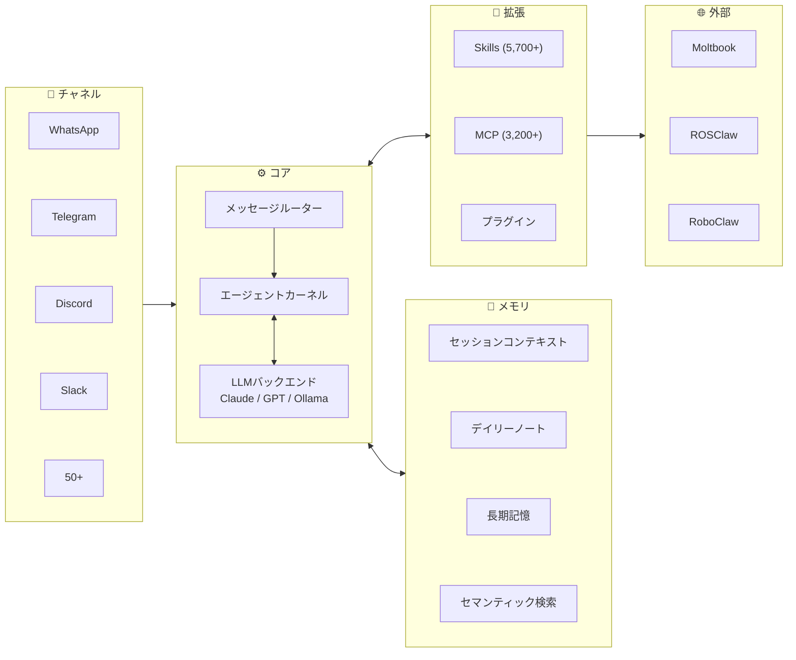

# Awesome-OpenClaw-Research [](https://awesome.re)


🦞 **OpenClaw** は2025年11月にローンチされ、**84日間**でGitHubスター20万を突破、2026年3月には**33万スター**を超えました。本リポジトリは**OpenClawエコシステムを対象とした研究論文**を収集しています — エージェント基盤、学習、安全性、身体化、社会的動態、ドメイン応用をカバー。問いは普遍的であり、OpenClawはそのレンズです。

<p align="center">
  <a href="#-論文"></a>
  <a href="https://github.com/openclaw/openclaw"></a>
  <a href="./README.md"></a>
  <a href="./README_CN.md"></a>
  <a href="./README_KR.md"></a>
  <a href="#-貢献ガイド"></a>
  <a href="https://join.slack.com/t/openclaw-research/shared_invite/zt-3tetckn5x-tOKVsEEQN8ArnyxzqgWsAA"></a>
</p>

---

## 目次

- [論文（Papers）](#-論文) — **本リポジトリの中核**
  - [Infrastructure & Systems](#infrastructure--systems)（インフラ＆システム）
  - [Learning & Evolution](#learning--evolution)（学習＆進化）
  - [Safety & Security](#safety--security)（安全＆セキュリティ）
  - [Embodied Agents](#embodied-agents)（身体化エージェント）
  - [Agent Society](#agent-society)（エージェント社会）
  - [Domain Applications](#domain-applications)（ドメイン応用）
- [アーキテクチャ](#-アーキテクチャ)
- [エコシステム年表](#-エコシステム年表)
- [その他のリソース](#-その他のリソース) — SDK、ツール、コミュニティ、関連リポジトリ
- [貢献ガイド](#-貢献ガイド)

---

## 📄 論文

> 2026年2〜3月のみでも25本以上の論文が公開されています。各項目には論文リンク、コード（あれば）、要点を記載しています。

### Infrastructure & Systems（インフラ＆システム）

> フレームワーク、OSパラダイム、ベンチマーク、プロトコル評価。

| タイトル | 学会 | 日付 | 論文 | コード | 要点 |
|----------|------|------|------|--------|------|
| **OpenClaw as Language Infrastructure (Survey)** | Preprints.org | 2026.03 | [](https://www.preprints.org/manuscript/202603.1060) |  | GATE / AERO frameworks; analyzes 38 ecosystem papers |
| **AgentOS: NL-Driven OS Paradigm** | arXiv | 2026.03 | [](https://arxiv.org/abs/2603.08938) |  | Agent-centric OS paradigm; Skills-as-Modules; KDD framing |
| **EvoClaw: Evaluating AI Agents on Continuous Software Evolution** | arXiv | 2026.03 | [](https://arxiv.org/abs/2603.13428) | [](https://github.com/Hydrapse/EvoClaw) [](https://huggingface.co/datasets/hyd2apse/EvoClaw-data) | DeepCommit Milestone DAGs; 7 repos / 5 languages; best agent only 38% in continuous settings |
| **MCP-Atlas: Large-Scale Benchmark for MCP Tool-Use** | arXiv | 2026.02 | [](https://arxiv.org/abs/2602.00933) |  | 36 MCP servers; 220 tools; 1,000 tasks; multi-step workflow eval |

### Learning & Evolution（学習＆進化）

> 強化学習、メタ学習、エージェントの自己改善。

| タイトル | 学会 | 日付 | 論文 | コード | 要点 |
|----------|------|------|------|--------|------|
| **OpenClaw-RL: Train Any Agent Simply by Talking** | arXiv | 2026.03 | [](https://arxiv.org/abs/2603.10165) | [](https://github.com/Gen-Verse/OpenClaw-RL) | Evaluative + Directive signals; async 4-component RL architecture; personalization 0.17→0.81 |
| **MetaClaw: Meta-Learning in the Wild** | arXiv | 2026.03 | [](https://arxiv.org/abs/2603.17187) |  | Continuous meta-learning; skill-driven adaptation; accuracy 21.4% → 40.6% |

### Safety & Security（安全＆セキュリティ）

> 攻撃ベンチマーク、防御フレームワーク、サプライチェーンセキュリティ、ランタイム保護。

| タイトル | 学会 | 日付 | 論文 | コード | 要点 |
|----------|------|------|------|--------|------|
| **PASB: Benchmarking Attacks on OpenClaw** | arXiv | 2026.02 | [](https://arxiv.org/abs/2602.08412) | [](https://github.com/AstorYH/PASB) | End-to-end security eval; only 17% native defense rate |
| **A Trajectory-Based Safety Audit of Clawdbot (OpenClaw)** | arXiv | 2026.02 | [](https://arxiv.org/abs/2602.14364) | [](https://github.com/tychenn/clawdbot_report) | 34 test cases / 6 risk dimensions; overall pass rate 58.9%; Intent Misunderstanding 0% |
| **SkillFortify: Formal Supply Chain Security** | arXiv | 2026.03 | [](https://arxiv.org/abs/2603.00195) | [](https://github.com/qualixar/skillfortify) [](https://pypi.org/project/skillfortify/) | Dolev-Yao modeling; 96.95% F1; 0% false positives; 22 agent frameworks |
| **Don't Let the Claw Grip Your Hand** | arXiv | 2026.03 | [](https://arxiv.org/abs/2603.10387) |  | 47 adversarial scenarios; MITRE ATLAS/ATT&CK; HITL defense: 17% → 19–92% |
| **OpenClaw PRISM: Runtime Security Layer** | arXiv | 2026.03 | [](https://arxiv.org/abs/2603.11853) |  | Defense-in-depth; zero-fork; anti prompt injection |
| **Uncovering Security Threats & Architecting Defenses (FASA)** | arXiv | 2026.03 | [](https://arxiv.org/abs/2603.12644) |  | Tsinghua & Ant Group; tri-layered risk taxonomy; FASA + ClawGuard; 26% community tools have vulns |
| **Defensible Design for OpenClaw** | arXiv | 2026.03 | [](https://arxiv.org/abs/2603.13151) |  | Security-as-engineering blueprint; risk taxonomy; practical research agenda |

### Embodied Agents（身体化エージェント）

> ロボティクス、物理的実体化、ROS統合。

| タイトル | 学会 | 日付 | 論文 | コード | 要点 |
|----------|------|------|------|--------|------|
| **RoboClaw: An Agentic Framework for Scalable Long-Horizon Robotic Tasks** | arXiv | 2026.03 | [](https://arxiv.org/abs/2603.11558) | [](https://github.com/RoboClaw-Robotics/RoboClaw) | VLA model; Entangled Action Pairs; +25% success rate; −53.7% human effort |
| **RoboClaw (MINT): Open-Source Embodied Intelligence Assistant** | GitHub | 2026.03 |  | [](https://github.com/MINT-SJTU/RoboClaw) | Conversational arm setup; calibration & teleoperation; built on OpenClaw ecosystem |
| **ROSClaw: Bridging OpenClaw with ROS 2** | GitHub | 2026.03 | [](https://openclaws.io/blog/openclaw-robotics-embodied-ai) | [](https://github.com/PlaiPin/rosclaw) | SF Hackathon champion; Unitree G1/H1, DJI; runs on RPi4 |
| **RoClaw: Physical Embodiment for OpenClaw** | GitHub | 2026.03 | [](https://evoailabs.medium.com/the-rapid-transformation-of-openclaw-into-a-physical-ai-powerhouse-911d8546c1c0) | [](https://github.com/EvolvingAgentsLabs/RoClaw) | Dual-Brain bytecode architecture; somatic firmware; open-source hardware CAD & simulation |

### Agent Society（エージェント社会）

> エージェント集団における社会的行動、創発的規範、ピア学習、集団ダイナミクス。

| タイトル | 学会 | 日付 | 論文 | コード | 要点 |
|----------|------|------|------|--------|------|
| **Risky Sharing & Norm Enforcement** | arXiv | 2026.02 | [](https://arxiv.org/abs/2602.02625) |  | 39k posts / 14.5k agents; 18.4% action-inducing; emergent norm enforcement |
| **Peer Learning in the Moltbook Community** | arXiv | 2026.02 | [](https://arxiv.org/abs/2602.14477) |  | 2.4M agents' peer learning patterns |
| **OpenClaw Agents as Informal Learners at Moltbook** | arXiv | 2026.02 | [](https://arxiv.org/abs/2602.18832) |  | 2.8M agents' informal learning behavior |
| **From Agent-Only Social Networks to Autonomous Research** | arXiv | 2026.02 | [](https://arxiv.org/abs/2602.19810) |  | OpenClaw → Moltbook → ClawdLab; Sybil resistance; 5 architectural patterns |
| **When OpenClaw Agents Learn from Each Other** | arXiv | 2026.03 | [](https://arxiv.org/abs/2603.16663) |  | 167k agents; bidirectional scaffolding; emergent peer learning; implications for AIED |

### Domain Applications（ドメイン応用）

> 垂直ドメイン応用：医療、教育、科学的発見、パーソナライズドエージェントなど。

| タイトル | 学会 | 日付 | 論文 | コード | 要点 |
|----------|------|------|------|--------|------|
| **Toward Personalized LLM-Powered Agents** | arXiv | 2026.02 | [](https://arxiv.org/abs/2602.22680) |  | Four components: Profile / Memory / Planning / Action |
| **When OpenClaw Meets Hospital: Agentic OS for Clinical Workflows** | arXiv | 2026.03 | [](https://arxiv.org/abs/2603.11721) |  | Restricted execution; document-centric interaction; page-indexed memory; medical skill library |
| **EduClaw: Scaling Laws for Educational AI Agents** | arXiv | 2026.03 | [](https://arxiv.org/abs/2603.11709) |  | Agent Scaling Law; AgentProfile framework; 330+ profiles & 1,100+ skill modules across K-12 |
| **ScienceClaw + INFINITE: Autonomous Agents Coordinating Distributed Discovery** | arXiv | 2026.03 | [](https://arxiv.org/abs/2603.14312) | [](https://github.com/lamm-mit/scienceclaw) | MIT LAMM; 300+ scientific skills; ArtifactReactor; peptide design / ceramic screening / cross-domain |

---

## 🏗 アーキテクチャ



---

## 📅 エコシステム年表

```
2025.11 ─── ローンチ（ClawdBot / Moltbot → OpenClaw）
    │
2025.12 ─── ClawHub スキルマーケットプレイス
    │
2026.01 ─── Moltbook（150万エージェント / 72時間）─── 学術論文の爆発（6本 / 2週間）
    │
2026.02 ─── ClawHavoc 攻撃 ─── CVE-2026-25253 ─── 20万スター（84日間）
    │         │
    │         └── 対応：VirusTotal ＋ 監査メカニズム
    │
2026.03 ─── RL / メタ学習 / ロボティクス関連の論文 ─── 33万スター
    │
    └── ROSClaw ハッカソン優勝 ─── v2026.3.13-1（68回目のリリース）
              │
              └── WeChat公式ClawBotプラグイン（03.22）
                    │
                    └── 国家サイバーセキュリティ勧告（中国、03.13）
```

<details>
<summary><b>完全な年表</b></summary>

| 日付 | 出来事 |
|------|--------|
| 2025.11.24 | OpenClaw（旧称 ClawdBot / Moltbot）ローンチ |
| 2025.12 | ClawHub スキルマーケットプレイス公開 |
| 2026.01 | Moltbook ローンチ — 72時間で150万エージェントが登録 |
| 2026.01 | 2週間で学術論文6本が発表 |
| 2026.02.02 | Risky Sharing & Norm Enforcement 論文 |
| 2026.02 | PASB セキュリティ評価論文 |
| 2026.02 | ClawHavoc サプライチェーン攻撃 — 悪意あるスキル1,184件 |
| 2026.02 | CVE-2026-25253 公表（RCE、CVSS 8.8） |
| 2026.02.16 | GitHub スター数が20万を突破（84日間） |
| 2026.02 | OpenClaw と VirusTotal のセキュリティ提携 |
| 2026.03 | OpenClaw-RL / MetaClaw / AgentOS / RoboClaw などの論文 |
| 2026.03 | ROSClaw が SF OpenClaw ハッカソンで優勝 |
| 2026.03.13 | v2026.3.13-1 リリース（68回目のリリース） |
| 2026.03.13 | 中国国家サイバーセキュリティ勧告 |
| 2026.03.22 | WeChat 公式 ClawBot プラグイン公開 |
| 2026.03 | GitHub スター数が33万を突破 |

</details>

---

## 📦 その他のリソース

<details>
<summary><b>公式リンク</b></summary>

| 名称 | リンク |
|------|--------|
| OpenClaw Core | [github.com/openclaw/openclaw](https://github.com/openclaw/openclaw) |
| ClawHub Marketplace | [clawhub.com](https://clawhub.com) |
| Official Docs | [docs.openclaw.ai](https://docs.openclaw.ai) |

</details>

<details>
<summary><b>SDK＆ツール</b></summary>

| 名称 | 言語 | 説明 |
|------|------|------|
| [openclaw-sdk](https://masteryodaa.github.io/openclaw-sdk/) | Python | Build & publish autonomous AI agents |
| [mcp-bridge-openclaw](https://www.npmjs.com/package/mcp-bridge-openclaw) | TypeScript | MCP multi-server bridge |
| [amor71/openclaw-mcp](https://github.com/amor71/openclaw-mcp) | TypeScript | Native MCP client |
| [henry-y/openclaw-paper-tools](https://github.com/henry-y/openclaw-paper-tools) | Python | OpenClaw arXiv paper reader |

</details>

<details>
<summary><b>自動化研究ツール</b></summary>

| 名称 | リンク | 説明 |
|------|--------|------|
| AutoResearchClaw | [GitHub](https://github.com/aiming-lab/AutoResearchClaw) | Fully autonomous 23-stage research pipeline: idea → experiment → conference-ready paper; multi-agent peer review |
| OpenClaw-Medical-Skills | [GitHub](https://github.com/FreedomIntelligence/OpenClaw-Medical-Skills) | 869 curated medical AI skills covering clinical work, genomics, drug discovery & bioinformatics |
| ScienceClaw | [GitHub](https://github.com/Zaoqu-Liu/ScienceClaw) | Autonomous research pipeline; 266+ domain skills; 77+ databases |
| ClawCures | [GitHub](https://github.com/agentcures/ClawCures) | AI campaign orchestrator for drug discovery; planner/critic loops; ADMET maps |

</details>

<details>
<summary><b>セキュリティ参考資料</b></summary>

| 名称 | リンク |
|------|--------|
| PASB Framework | [GitHub](https://github.com/AstorYH/PASB) |
| SkillFortify | [GitHub](https://github.com/qualixar/skillfortify) · [PyPI](https://pypi.org/project/skillfortify/) |
| SecureClaw | [GitHub](https://github.com/adversa-ai/secureclaw) |
| SlowMist Security Guide | [GitHub](https://github.com/slowmist/openclaw-security-practice-guide) |
| CVE-2026-25253 | [NVD](https://nvd.nist.gov/vuln/detail/CVE-2026-25253) |
| Security Guide | [bitdoze.com](https://www.bitdoze.com/openclaw-security-guide/) |

</details>

<details>
<summary><b>ベンチマーク</b></summary>

| 名称 | リンク | 説明 |
|------|--------|------|
| PinchBench | [pinchbench.com](https://pinchbench.com) · [GitHub](https://github.com/pinchbench/skill) | 23 real-world tasks across 8 categories; automated + LLM judge grading |
| EvoClaw | [evo-claw.com](https://evo-claw.com) · [HuggingFace](https://huggingface.co/datasets/hyd2apse/EvoClaw-data) | Continuous software evolution benchmark; 7 repos / 5 languages / 98 milestones |

</details>

<details>
<summary><b>中国語コミュニティ</b></summary>

| 名称 | リンク | 説明 |
|------|--------|------|
| OpenClaw China | [BytePioneer-AI/openclaw-china](https://github.com/BytePioneer-AI/moltbot-china) | Domestic IM adaption (3,200+ Stars) |
| 中文社区 | [clawd.org.cn](https://clawd.org.cn) | Feishu / DingTalk / WeCom / QQ |
| 中文教程 | [openclawgithub.cc](https://openclawgithub.cc) | Config & integration guides |
| Hello Claw | [Datawhale](https://datawhalechina.github.io/hello-claw/) | Datawhale tutorial |
| 中文站 | [clawcn.net](https://clawcn.net) | Domestic LLM guide |
| Learn OpenClaw | [learnopenclaw.com](https://learnopenclaw.com) | Learning platform |

</details>

<details>
<summary><b>関連リポジトリ</b></summary>

> 見落としている優れた OpenClaw プロジェクトがあれば、Pull Request で教えてください。リストを一緒に育てましょう。

| リポジトリ | スター数 | 説明 |
|------------|----------|------|
| [SamurAIGPT/awesome-openclaw](https://github.com/SamurAIGPT/awesome-openclaw) | 823 | Comprehensive list of OpenClaw resources, tools, skills, tutorials & articles |
| [mergisi/awesome-openclaw-agents](https://github.com/mergisi/awesome-openclaw-agents) | 830+ | 177 production-ready AI agent templates across 24 categories |
| [VoltAgent/awesome-openclaw-skills](https://github.com/VoltAgent/awesome-openclaw-skills) | — | Community curated skills collection |
| [community/openclaw-recipes](https://github.com/community/openclaw-recipes) | — | Common automation recipes |
| [templates/claw-templates](https://github.com/templates/claw-templates) | — | Starter templates for OpenClaw projects |
| [pranciskus/discourse-openclaw](https://github.com/pranciskus/discourse-openclaw) | NEW | Discourse forum integration with 12 tools |
| [wanikua/ByeByeClaw](https://github.com/wanikua/byebyeclaw) | NEW | One-command uninstaller for all Claw-family agents |

</details>

---

## 🤝 貢献ガイド

コントリビューションを歓迎します。特に以下の分野でご協力をお願いします。

- **論文** — 不足している OpenClaw 関連論文の追加（適切なリンク付き）
- **分析** — 論文ノートと要点の改善
- **タイムライン** — 新しい出来事に基づくエコシステム年表の更新
- **翻訳** — 多言語コンテンツの翻訳

[Pull Request](https://github.com/shuolucs/Awesome-OpenClaw-Research/pulls) でご提出ください。

他の言語バージョン：[README.md](./README.md)（English）、[README_CN.md](./README_CN.md)（中文）、[README_KR.md](./README_KR.md)（한국어）

---

## ⭐ Star History

[](https://star-history.com/#shuolucs/Awesome-OpenClaw-Research&Date)

このプロジェクトが役に立ったら、Star をお願いします！
