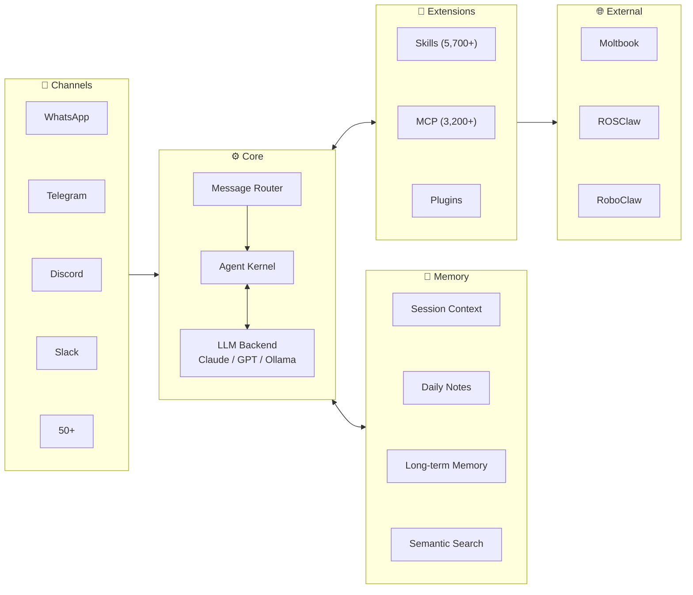

# Awesome-OpenClaw-Research [](https://awesome.re)


🦞 **OpenClaw**는 2025년 11월에 공개되어 **84일 만에** GitHub 스타 20만에 도달했고, 2026년 3월에는 **33만 스타**를 넘어섰습니다. 이 저장소는 **OpenClaw 생태계를 연구하거나 그 위에 구축된 논문**을 모읍니다 — 에이전트 인프라, 학습, 안전, 신체화, 사회 역학 및 도메인 응용을 포괄합니다. 질문은 보편적이며, OpenClaw는 그 렌즈입니다.

<p align="center">
  <a href="#-논문"></a>
  <a href="https://github.com/openclaw/openclaw"></a>
  <a href="./README.md"></a>
  <a href="./README_CN.md"></a>
  <a href="./README_JP.md"></a>
  <a href="#-기여-가이드"></a>
  <a href="https://join.slack.com/t/openclaw-research/shared_invite/zt-3tetckn5x-tOKVsEEQN8ArnyxzqgWsAA"></a>
</p>

---

## 목차

- [논문](#-논문) — **이 저장소의 핵심**
  - [Infrastructure & Systems](#infrastructure--systems) (인프라 및 시스템)
  - [Learning & Evolution](#learning--evolution) (학습 및 진화)
  - [Safety & Security](#safety--security) (보안 및 신뢰)
  - [Embodied Agents](#embodied-agents) (신체화 에이전트)
  - [Agent Society](#agent-society) (에이전트 사회)
  - [Domain Applications](#domain-applications) (도메인 응용)
- [아키텍처](#-아키텍처)
- [생태계 타임라인](#-생태계-타임라인)
- [기타 자료](#-기타-자료) — SDK, 도구, 커뮤니티, 관련 저장소
- [기여 가이드](#-기여-가이드)

---

## 📄 논문

> 2026년 2–3월만 해도 25편 이상의 논문이 발표되었습니다. 각 항목에는 논문 링크, 코드(해당 시), 주요 요점이 포함됩니다.

### Infrastructure & Systems (인프라 및 시스템)

> 프레임워크, OS 패러다임, 벤치마크 및 프로토콜 평가.

| 제목 | 학회 | 날짜 | 논문 | 코드 | 요점 |
|-------|-------|------|-------|------|------------|
| **OpenClaw as Language Infrastructure (Survey)** | Preprints.org | 2026.03 | [](https://www.preprints.org/manuscript/202603.1060) |  | GATE / AERO frameworks; analyzes 38 ecosystem papers |
| **AgentOS: NL-Driven OS Paradigm** | arXiv | 2026.03 | [](https://arxiv.org/abs/2603.08938) |  | Agent-centric OS paradigm; Skills-as-Modules; KDD framing |
| **EvoClaw: Evaluating AI Agents on Continuous Software Evolution** | arXiv | 2026.03 | [](https://arxiv.org/abs/2603.13428) | [](https://github.com/Hydrapse/EvoClaw) [](https://huggingface.co/datasets/hyd2apse/EvoClaw-data) | DeepCommit Milestone DAGs; 7 repos / 5 languages; best agent only 38% in continuous settings |
| **MCP-Atlas: Large-Scale Benchmark for MCP Tool-Use** | arXiv | 2026.02 | [](https://arxiv.org/abs/2602.00933) |  | 36 MCP servers; 220 tools; 1,000 tasks; multi-step workflow eval |

### Learning & Evolution (학습 및 진화)

> 강화학습, 메타학습 및 에이전트 자기 개선.

| 제목 | 학회 | 날짜 | 논문 | 코드 | 요점 |
|-------|-------|------|-------|------|------------|
| **OpenClaw-RL: Train Any Agent Simply by Talking** | arXiv | 2026.03 | [](https://arxiv.org/abs/2603.10165) | [](https://github.com/Gen-Verse/OpenClaw-RL) | Evaluative + Directive signals; async 4-component RL architecture; personalization 0.17→0.81 |
| **MetaClaw: Meta-Learning in the Wild** | arXiv | 2026.03 | [](https://arxiv.org/abs/2603.17187) |  | Continuous meta-learning; skill-driven adaptation; accuracy 21.4% → 40.6% |

### Safety & Security (보안 및 신뢰)

> 공격 벤치마크, 방어 프레임워크, 공급망 보안 및 런타임 보호.

| 제목 | 학회 | 날짜 | 논문 | 코드 | 요점 |
|-------|-------|------|-------|------|------------|
| **PASB: Benchmarking Attacks on OpenClaw** | arXiv | 2026.02 | [](https://arxiv.org/abs/2602.08412) | [](https://github.com/AstorYH/PASB) | End-to-end security eval; only 17% native defense rate |
| **A Trajectory-Based Safety Audit of Clawdbot (OpenClaw)** | arXiv | 2026.02 | [](https://arxiv.org/abs/2602.14364) | [](https://github.com/tychenn/clawdbot_report) | 34 test cases / 6 risk dimensions; overall pass rate 58.9%; Intent Misunderstanding 0% |
| **SkillFortify: Formal Supply Chain Security** | arXiv | 2026.03 | [](https://arxiv.org/abs/2603.00195) | [](https://github.com/qualixar/skillfortify) [](https://pypi.org/project/skillfortify/) | Dolev-Yao modeling; 96.95% F1; 0% false positives; 22 agent frameworks |
| **Don't Let the Claw Grip Your Hand** | arXiv | 2026.03 | [](https://arxiv.org/abs/2603.10387) |  | 47 adversarial scenarios; MITRE ATLAS/ATT&CK; HITL defense: 17% → 19–92% |
| **OpenClaw PRISM: Runtime Security Layer** | arXiv | 2026.03 | [](https://arxiv.org/abs/2603.11853) |  | Defense-in-depth; zero-fork; anti prompt injection |
| **Uncovering Security Threats & Architecting Defenses (FASA)** | arXiv | 2026.03 | [](https://arxiv.org/abs/2603.12644) |  | Tsinghua & Ant Group; tri-layered risk taxonomy; FASA + ClawGuard; 26% community tools have vulns |
| **Defensible Design for OpenClaw** | arXiv | 2026.03 | [](https://arxiv.org/abs/2603.13151) |  | Security-as-engineering blueprint; risk taxonomy; practical research agenda |

### Embodied Agents (신체화 에이전트)

> 로보틱스, 물리적 구현 및 ROS 통합.

| 제목 | 학회 | 날짜 | 논문 | 코드 | 요점 |
|-------|-------|------|-------|------|------------|
| **RoboClaw: An Agentic Framework for Scalable Long-Horizon Robotic Tasks** | arXiv | 2026.03 | [](https://arxiv.org/abs/2603.11558) | [](https://github.com/RoboClaw-Robotics/RoboClaw) | VLA model; Entangled Action Pairs; +25% success rate; −53.7% human effort |
| **RoboClaw (MINT): Open-Source Embodied Intelligence Assistant** | GitHub | 2026.03 |  | [](https://github.com/MINT-SJTU/RoboClaw) | Conversational arm setup; calibration & teleoperation; built on OpenClaw ecosystem |
| **ROSClaw: Bridging OpenClaw with ROS 2** | GitHub | 2026.03 | [](https://openclaws.io/blog/openclaw-robotics-embodied-ai) | [](https://github.com/PlaiPin/rosclaw) | SF Hackathon champion; Unitree G1/H1, DJI; runs on RPi4 |
| **RoClaw: Physical Embodiment for OpenClaw** | GitHub | 2026.03 | [](https://evoailabs.medium.com/the-rapid-transformation-of-openclaw-into-a-physical-ai-powerhouse-911d8546c1c0) | [](https://github.com/EvolvingAgentsLabs/RoClaw) | Dual-Brain bytecode architecture; somatic firmware; open-source hardware CAD & simulation |

### Agent Society (에이전트 사회)

> 에이전트 집단의 사회적 행동, 창발적 규범, 동료 학습 및 집단 역학.

| 제목 | 학회 | 날짜 | 논문 | 코드 | 요점 |
|-------|-------|------|-------|------|------------|
| **Risky Sharing & Norm Enforcement** | arXiv | 2026.02 | [](https://arxiv.org/abs/2602.02625) |  | 39k posts / 14.5k agents; 18.4% action-inducing; emergent norm enforcement |
| **Peer Learning in the Moltbook Community** | arXiv | 2026.02 | [](https://arxiv.org/abs/2602.14477) |  | 2.4M agents' peer learning patterns |
| **OpenClaw Agents as Informal Learners at Moltbook** | arXiv | 2026.02 | [](https://arxiv.org/abs/2602.18832) |  | 2.8M agents' informal learning behavior |
| **From Agent-Only Social Networks to Autonomous Research** | arXiv | 2026.02 | [](https://arxiv.org/abs/2602.19810) |  | OpenClaw → Moltbook → ClawdLab; Sybil resistance; 5 architectural patterns |
| **When OpenClaw Agents Learn from Each Other** | arXiv | 2026.03 | [](https://arxiv.org/abs/2603.16663) |  | 167k agents; bidirectional scaffolding; emergent peer learning; implications for AIED |

### Domain Applications (도메인 응용)

> 수직 도메인 응용: 의료, 교육, 과학적 발견, 개인화 에이전트 등.

| 제목 | 학회 | 날짜 | 논문 | 코드 | 요점 |
|-------|-------|------|-------|------|------------|
| **Toward Personalized LLM-Powered Agents** | arXiv | 2026.02 | [](https://arxiv.org/abs/2602.22680) |  | Four components: Profile / Memory / Planning / Action |
| **When OpenClaw Meets Hospital: Agentic OS for Clinical Workflows** | arXiv | 2026.03 | [](https://arxiv.org/abs/2603.11721) |  | Restricted execution; document-centric interaction; page-indexed memory; medical skill library |
| **EduClaw: Scaling Laws for Educational AI Agents** | arXiv | 2026.03 | [](https://arxiv.org/abs/2603.11709) |  | Agent Scaling Law; AgentProfile framework; 330+ profiles & 1,100+ skill modules across K-12 |
| **ScienceClaw + INFINITE: Autonomous Agents Coordinating Distributed Discovery** | arXiv | 2026.03 | [](https://arxiv.org/abs/2603.14312) | [](https://github.com/lamm-mit/scienceclaw) | MIT LAMM; 300+ scientific skills; ArtifactReactor; peptide design / ceramic screening / cross-domain |

---

## 🏗 아키텍처



---

## 📅 생태계 타임라인

```
2025.11 ─── 출시 (ClawdBot / Moltbot → OpenClaw)
    │
2025.12 ─── ClawHub 스킬 마켓플레이스
    │
2026.01 ─── Moltbook (72시간 내 150만 에이전트) ─── 학술 논문 붐 (2주간 6편)
    │
2026.02 ─── ClawHavoc 공격 ─── CVE-2026-25253 ─── 200k 스타 (84일)
    │         │
    │         └── 대응: VirusTotal + 감사 메커니즘
    │
2026.03 ─── RL / 메타학습 / 로보틱스 논문 ─── 330k 스타
    │
    └── ROSClaw SF 해커톤 우승 ─── v2026.3.13-1 (68번째 릴리스)
              │
              └── 위챗 공식 ClawBot 플러그인 (03.22)
                    │
                    └── 중국 국가 사이버보안 권고 (03.13)
```

<details>
<summary><b>전체 타임라인</b></summary>

| 날짜 | 이벤트 |
|------|--------|
| 2025.11.24 | OpenClaw(구 ClawdBot / Moltbot) 출시 |
| 2025.12 | ClawHub 스킬 마켓플레이스 공개 |
| 2026.01 | Moltbook 출시 — 72시간 내 150만 에이전트 등록 |
| 2026.01 | 2주간 학술 논문 6편 발표 |
| 2026.02.02 | Risky Sharing & Norm Enforcement 논문 |
| 2026.02 | PASB 보안 평가 논문 |
| 2026.02 | ClawHavoc 공급망 공격 — 악성 스킬 1,184개 |
| 2026.02 | CVE-2026-25253 공개 (RCE, CVSS 8.8) |
| 2026.02.16 | GitHub 스타 20만 돌파 (84일) |
| 2026.02 | OpenClaw + VirusTotal 보안 파트너십 |
| 2026.03 | OpenClaw-RL / MetaClaw / AgentOS / RoboClaw 논문 |
| 2026.03 | ROSClaw, SF OpenClaw 해커톤 우승 |
| 2026.03.13 | v2026.3.13-1 릴리스 (68번째 릴리스) |
| 2026.03.13 | 중국 국가 사이버보안 권고 |
| 2026.03.22 | 위챗 공식 ClawBot 플러그인 공개 |
| 2026.03 | GitHub 스타 33만 돌파 |

</details>

---

## 📦 기타 자료

<details>
<summary><b>공식 링크 (Official Links)</b></summary>

| 이름 | 링크 |
|------|------|
| OpenClaw Core | [github.com/openclaw/openclaw](https://github.com/openclaw/openclaw) |
| ClawHub Marketplace | [clawhub.com](https://clawhub.com) |
| Official Docs | [docs.openclaw.ai](https://docs.openclaw.ai) |

</details>

<details>
<summary><b>SDK 및 도구</b></summary>

| Name | Language | Description |
|------|----------|-------------|
| [openclaw-sdk](https://masteryodaa.github.io/openclaw-sdk/) | Python | Build & publish autonomous AI agents |
| [mcp-bridge-openclaw](https://www.npmjs.com/package/mcp-bridge-openclaw) | TypeScript | MCP multi-server bridge |
| [amor71/openclaw-mcp](https://github.com/amor71/openclaw-mcp) | TypeScript | Native MCP client |
| [henry-y/openclaw-paper-tools](https://github.com/henry-y/openclaw-paper-tools) | Python | OpenClaw arXiv paper reader |

</details>

<details>
<summary><b>자동화 연구 도구</b></summary>

| Name | Link | Description |
|------|------|-------------|
| AutoResearchClaw | [GitHub](https://github.com/aiming-lab/AutoResearchClaw) | Fully autonomous 23-stage research pipeline: idea → experiment → conference-ready paper; multi-agent peer review |
| OpenClaw-Medical-Skills | [GitHub](https://github.com/FreedomIntelligence/OpenClaw-Medical-Skills) | 869 curated medical AI skills covering clinical work, genomics, drug discovery & bioinformatics |
| ScienceClaw | [GitHub](https://github.com/Zaoqu-Liu/ScienceClaw) | Autonomous research pipeline; 266+ domain skills; 77+ databases |
| ClawCures | [GitHub](https://github.com/agentcures/ClawCures) | AI campaign orchestrator for drug discovery; planner/critic loops; ADMET maps |

</details>

<details>
<summary><b>보안 참고자료</b></summary>

| Name | Link |
|------|------|
| PASB Framework | [GitHub](https://github.com/AstorYH/PASB) |
| SkillFortify | [GitHub](https://github.com/qualixar/skillfortify) · [PyPI](https://pypi.org/project/skillfortify/) |
| SecureClaw | [GitHub](https://github.com/adversa-ai/secureclaw) |
| SlowMist Security Guide | [GitHub](https://github.com/slowmist/openclaw-security-practice-guide) |
| CVE-2026-25253 | [NVD](https://nvd.nist.gov/vuln/detail/CVE-2026-25253) |
| Security Guide | [bitdoze.com](https://www.bitdoze.com/openclaw-security-guide/) |

</details>

<details>
<summary><b>벤치마크</b></summary>

| Name | Link | Description |
|------|------|-------------|
| PinchBench | [pinchbench.com](https://pinchbench.com) · [GitHub](https://github.com/pinchbench/skill) | 23 real-world tasks across 8 categories; automated + LLM judge grading |
| EvoClaw | [evo-claw.com](https://evo-claw.com) · [HuggingFace](https://huggingface.co/datasets/hyd2apse/EvoClaw-data) | Continuous software evolution benchmark; 7 repos / 5 languages / 98 milestones |

</details>

<details>
<summary><b>중국어 커뮤니티</b></summary>

| Name | Link | Description |
|------|------|-------------|
| OpenClaw China | [BytePioneer-AI/openclaw-china](https://github.com/BytePioneer-AI/moltbot-china) | Domestic IM adaption (3,200+ Stars) |
| 中文社区 | [clawd.org.cn](https://clawd.org.cn) | Feishu / DingTalk / WeCom / QQ |
| 中文教程 | [openclawgithub.cc](https://openclawgithub.cc) | Config & integration guides |
| Hello Claw | [Datawhale](https://datawhalechina.github.io/hello-claw/) | Datawhale tutorial |
| 中文站 | [clawcn.net](https://clawcn.net) | Domestic LLM guide |
| Learn OpenClaw | [learnopenclaw.com](https://learnopenclaw.com) | Learning platform |

</details>

<details>
<summary><b>관련 저장소</b></summary>

> 빠진 훌륭한 OpenClaw 프로젝트가 있다면 PR로 알려 주시고 이 목록을 함께 키워 주세요!

| Repository | Stars | Description |
|------------|-------|-------------|
| [SamurAIGPT/awesome-openclaw](https://github.com/SamurAIGPT/awesome-openclaw) | 823 | Comprehensive list of OpenClaw resources, tools, skills, tutorials & articles |
| [mergisi/awesome-openclaw-agents](https://github.com/mergisi/awesome-openclaw-agents) | 830+ | 177 production-ready AI agent templates across 24 categories |
| [VoltAgent/awesome-openclaw-skills](https://github.com/VoltAgent/awesome-openclaw-skills) | — | Community curated skills collection |
| [community/openclaw-recipes](https://github.com/community/openclaw-recipes) | — | Common automation recipes |
| [templates/claw-templates](https://github.com/templates/claw-templates) | — | Starter templates for OpenClaw projects |
| [pranciskus/discourse-openclaw](https://github.com/pranciskus/discourse-openclaw) | NEW | Discourse forum integration with 12 tools |
| [wanikua/ByeByeClaw](https://github.com/wanikua/byebyeclaw) | NEW | One-command uninstaller for all Claw-family agents |

</details>

---

## 🤝 기여 가이드

기여를 환영합니다! 특히 다음 분야에서 도움이 필요합니다:

- **논문** — 누락된 OpenClaw 관련 논문을 적절한 링크와 함께 추가
- **분석** — 논문 노트 및 요점 개선
- **타임라인** — 새 이벤트로 생태계 타임라인 업데이트
- **번역** — 다국어 콘텐츠 번역

[Pull Request](https://github.com/shuolucs/Awesome-OpenClaw-Research/pulls)로 제출해 주세요. 다른 언어 버전: [README.md](./README.md) (English), [README_CN.md](./README_CN.md) (中文), [README_JP.md](./README_JP.md) (日本語)

---

## ⭐ Star History

[](https://star-history.com/#shuolucs/Awesome-OpenClaw-Research&Date)
